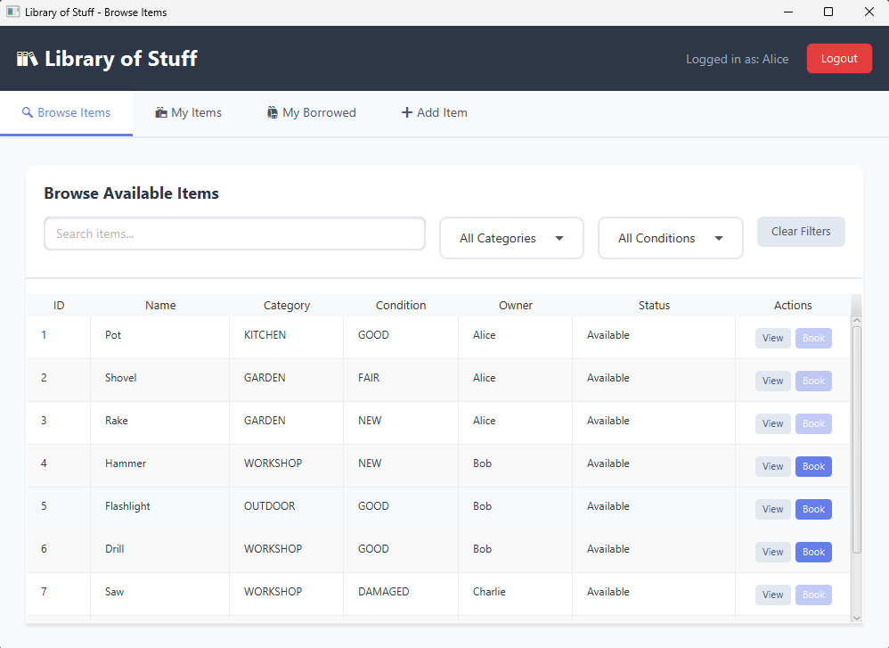
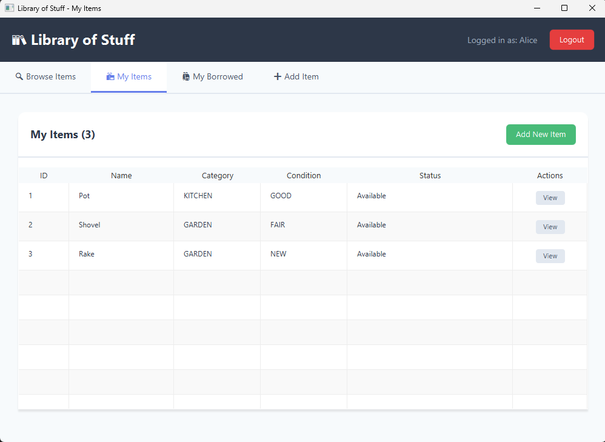
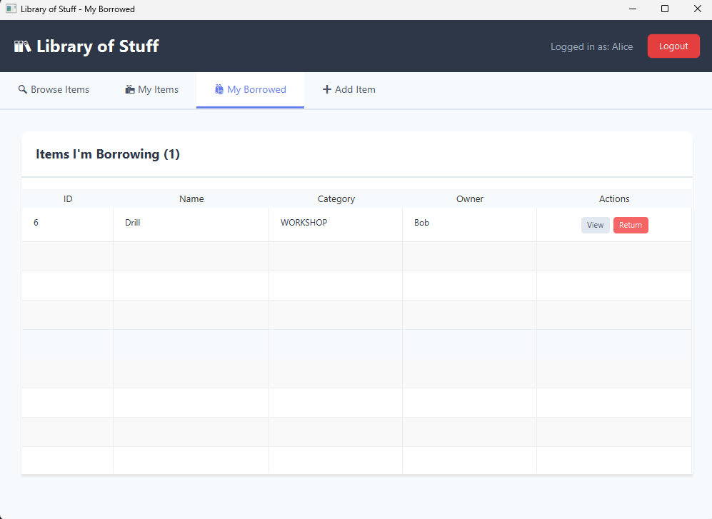
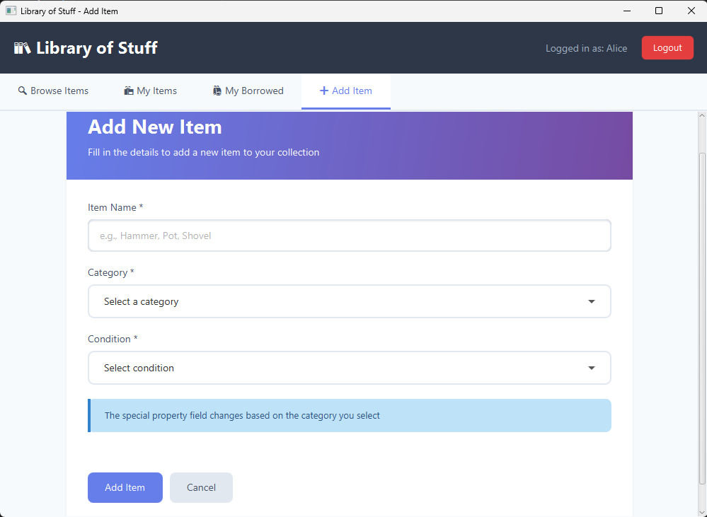

# 📦 Library of Stuff — Item Borrowing System

A desktop application for managing item borrowing between users, built with Java and JavaFX. Users can register items, browse available items, borrow and return them, and view full borrowing history.

## Screenshots







## Features

- Browse available items with search and filter by category/condition
- Borrow and return items with status tracking
- View full borrowing history per item
- Add items with category-specific properties (Kitchen, Garden, Workshop, Outdoor)
- Damaged items are automatically blocked from borrowing
- Multi-user support with session management

## Tech Stack

- Java 17+
- JavaFX (FXML + CSS)
- OOP design — inheritance, Factory pattern, encapsulation
- Java Stream API with lambda expressions

## Project Structure

```
src/
├── app/          # Controllers (Browse, MyItems, Borrowed, AddItem, Login)
├── service/      # BookingManager — core business logic
├── model/        # ItemBase, User, item types, enums
└── factory/      # ItemFactory
App.java          # Console version entry point
```

## How to Run

### GUI Version (JavaFX)
1. Make sure you have Java 17+ and JavaFX SDK installed
2. From project root, compile sources into `bin`:
   ```bash
   javac --module-path lib/javafx-sdk-25.0.1/lib --add-modules javafx.controls,javafx.fxml -d bin src/app/*.java src/factory/*.java src/model/*.java src/service/*.java src/App.java
   ```
3. Run JavaFX app:
   ```bash
   java --module-path lib/javafx-sdk-25.0.1/lib --add-modules javafx.controls,javafx.fxml -cp bin app.Main
   ```

### Console Version
```bash
javac -d bin src/factory/*.java src/model/*.java src/service/*.java src/App.java
java -cp bin App
```

## Architecture

The application uses a multi-paradigm approach:

- **OOP** — `ItemBase` abstract class extended by `KitchenItem`, `GardenItem`, `WorkshopItem`, `OutdoorItem`. `ItemFactory` handles object creation.
- **Functional** — Java Stream API used throughout controllers for filtering and searching
- **Declarative** — UI defined in FXML files with CSS styling

## Author

Ernest Tolstonohov — BSc Computer Science